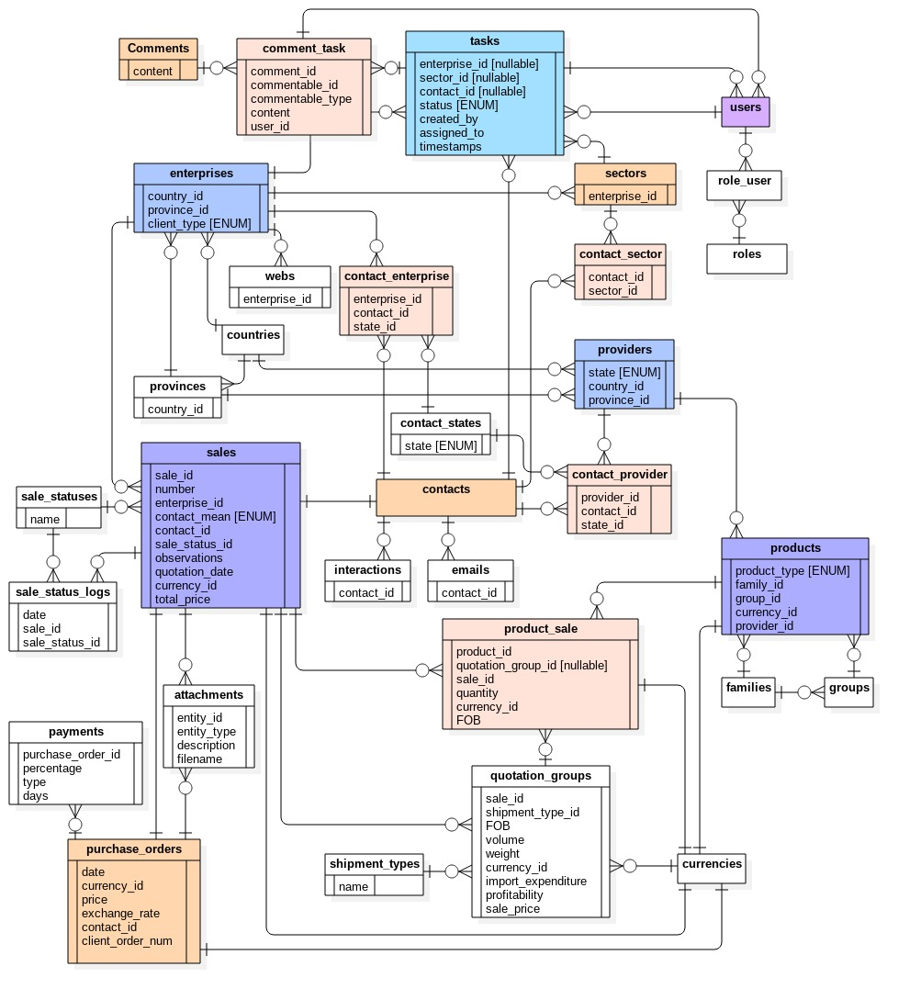

# DEMO [WIP]

## Tecnologías

El proyecto está basado en Laravel 5.4, React-Redux, Bootstrap y el template Metronic.

Corre con PHP 5.6 provisoriamente hasta actualizar servidores de QA y prod. 

### Metronic

Los assets tienen licencia y no estan versionados. Pero basicamente hay que pegar la carpeta _assets_ dentro de _public_.

Hay varios estilos en el template. Usamos Admin 1, con componentes de Bootstrap.

[http://keenthemes.com/preview/metronic/theme/admin_1/dashboard_2.html](http://keenthemes.com/preview/metronic/theme/admin_1/dashboard_2.html) 

En general todo el template esta basado en jQuery, así que hay cosas como las tablas que implementamos de otra fuente (de react-bootstrap-table)

## Ambiente local

### Docker

Para trabajo en local contamos con un stack virtualizado en Docker. En principio, contiene el mismo stack que en QA (apache 2, PHP 5.6, mysql 5.6).  

Para levantarlo:

`docker-compose up`

Eso queda escuchando en:

`http://localhost:8002`

### Config

Se necesita un archivo `.env` para levantar Laravel. Que no se versiona.

Para generarlo, tomar por referencia: `.env.example`

Hay algunos hash que hay que generar por cada ambiente. 

APP_KEY

`robo artisan key:generate`

PASSWORD_CLIENT_SECRET (y relacionados, corresponden a tokens de OAuth para dialogar con la API)

`robo artisan passport:install`

### React

A la par del servidor del backend, tenemos el servidor de webpack para desarrollo del front (configurado con hot-reloading).

En el folder *./client* estan los archivos en donde se desarrolla el front. Desde ahí levantamos el server:

`npm install & start` (install es solo la primera vez, cuando se esta armando el ambiente local)

Para compilar los cambios y verlos en la carpeta */public* (es decir, hacerlos productivos):

`npm run build`

Ese comando no solo genera los `js` y `js.map` sino que también copia la carpeta _client/src/static/assets_ a _/public/assets_

Resumiendo: no hay que tocar nada directamente en _/public_. Se trabaja en carpeta _/react_

#### hot reloading

Para trabajar en desarrollo compilamos con: 
`npm run build:dev`

Eso va a leer las librerías desde `/client/dist`, no desde `/public`

Entonces, todo archivo js que se toque va a verse inmediatamente reflejado en el navegador sin necesidad de recarga de pagina. 

Nota: Recordar que con hot-reloading si hay cambios se mantiene el estado global (redux), pero se pierde el estado local de componentes.  

#### Css & Sass

Los archivos de estilo estan en la carpeta _client/src/static/assets_. De ahi se copian solos a _/public_ mediante *webpack*.

Los _scss_ que vienen con el template no los usamos. Esos son obra de la gente de _metronic_ y nosotros no los modificamos.

En cuando a los *css*, tampoco los tocamos. Trabajamos _exclusivamente_ en:

`assets/custom.css`

## Utiles

### PHPmyadmin

`http://localhost:8081`

    - *server*: mysql-fws
    - *user*: root
    - *pass*: admin

### Logs

Laravel genera su propio archivo de log en `storage/logs/laravel.log`

Podemos verlo en tiempo real con `robo watch:log`

### Comandos 

#### Resetear la DB

Elimina las tablas y corre todas las migrations

`robo db:reset`

#### Correr Seeds 

Para ejecutar lo que sea con _artisan_ pasamos los parametros entre comillas (si son mas de uno)

`robo artisan "db:seed --class ProductSeeder"`

## Troubleshooting

##### The resource from “http://localhost:3000/app.f37b885e3de2a04f2525.js” was blocked due to MIME type mismatch (X-Content-Type-Options: nosniff).

Esto no es CORS (eso ya esta resuelto en la config de los servidores), sino que sencillamente el servidor no encuentra los archivos generados por _webpack_.

Chequear los permisos, sobretodo de directorios (`ls -lah ./public`)

```
sudo chown $USER:http ./public -R
find ./public -type d -exec chmod 775 {} \;
find ./public -type f -exec chmod 664 {} \;
```

Despues de esto es probable que haya que restartear el servidor:

`npm start`

## DER

Como este es un proyecto DEMO (para mostrar) muestro captura del DER actual (que refleja a la fecha aproximadamente un tercio del proyecto que pide el cliente). Este DER no lista las columnas sino solo las relaciones (FK) y campos ENUM. Las columnas estan documentadas en un doc interno. 

 


